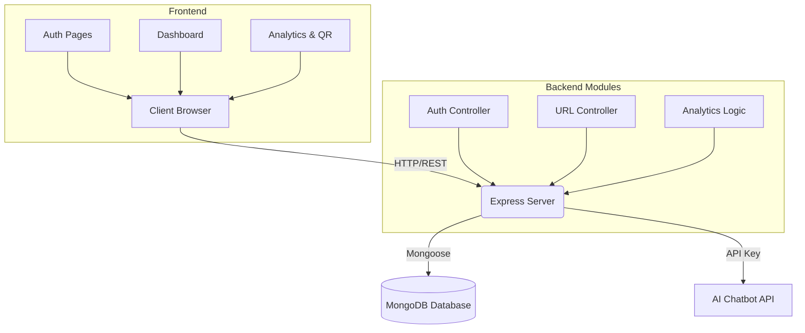
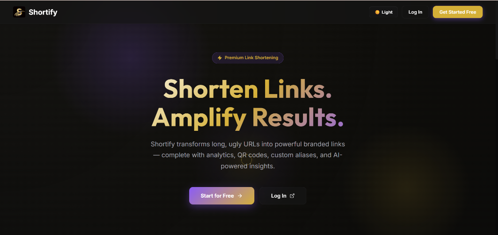
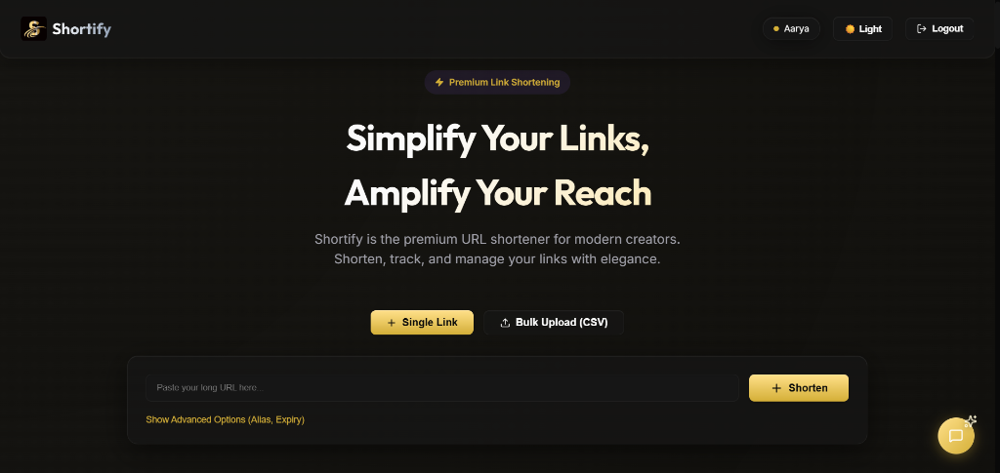
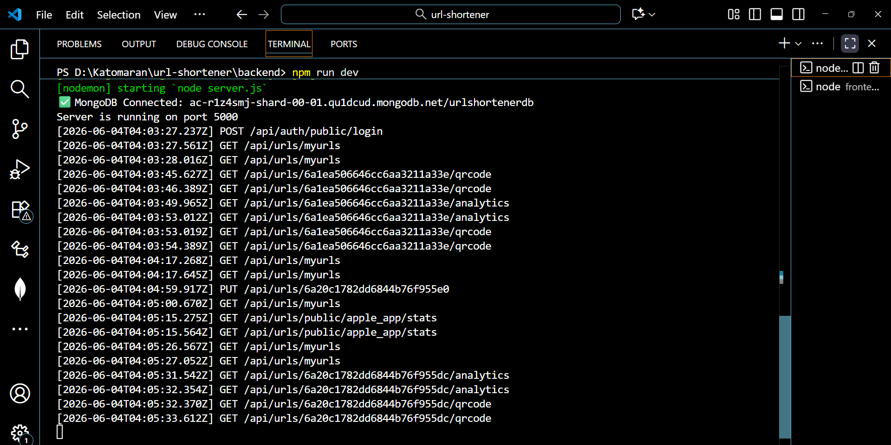

# Shortify - Smart URL Management Platform with AI Assistant

Shortify is a luxury, full-featured URL shortener built for modern creators, marketers, and developers. It transforms long URLs into branded links while providing deep analytics, QR code generation, bulk shortening, and an integrated AI Assistant.

## Features

- **Link Shortening & Custom Aliases:** Instantly shorten URLs and brand them with custom slugs (e.g., `/summer-sale`).
- **Deep Analytics:** Track click timelines (last 30 days), devices, browsers, referrers, and geolocation data.
- **Bulk CSV Upload:** Shorten hundreds of links at once with a simple CSV upload.
- **QR Code Generation:** Every shortened link gets a downloadable QR code for offline campaigns.
- **Link Expiry Control:** Set expiry dates for time-sensitive campaigns.
- **Public Stats Pages:** Transparent, shareable statistics for any of your links.
- **AI Chatbot Assistant:** Get instant insights on your metrics and platform features via our built-in AI.
- **Luxury UI:** A stunning, fully responsive glassmorphic design featuring both Dark and Light themes.

## Folder Structure

```text
url-shortener/
├── backend/                  # Node.js + Express Backend
│   ├── config/               # Database and environment configurations
│   ├── controllers/          # API endpoint logic (Auth, URLs, Analytics, Chat)
│   ├── middleware/           # Custom middlewares (e.g., JWT Authentication)
│   ├── models/               # Mongoose schemas (User, URL, Click)
│   ├── routes/               # API route definitions
│   ├── utils/                # Utility functions and helpers
│   └── server.js             # Express application entry point
├── frontend/                 # React + Vite Frontend
│   ├── public/               # Public static assets
│   ├── src/                  # React source code
│   │   ├── App.jsx           # Main React component and App Router
│   │   ├── AuthContext.jsx   # Authentication context provider
│   │   ├── ThemeContext.jsx  # Dark/Light mode theme provider
│   │   ├── Dashboard.jsx     # Main user dashboard interface
│   │   ├── UrlAnalytics.jsx  # Detailed analytics and QR interface
│   │   ├── LandingPage.jsx   # Public landing page with cursor effects
│   │   └── index.css         # Global styling and CSS variables
│   └── package.json          # Frontend dependencies
└── README.md                 # Project documentation
```

## Setup Instructions

### Prerequisites
- Node.js (v18+)
- MongoDB (Running locally or MongoDB Atlas)

### Backend Setup
1. Navigate to the `backend` directory:
   ```bash
   cd backend
   ```
2. Install dependencies:
   ```bash
   npm install
   ```
3. Create a `.env` file in the backend directory with the following variables:
   ```env
   PORT=8080
   MONGODB_URI=your_mongodb_connection_string
   JWT_SECRET=your_jwt_secret_key
   SAMBANOVA_API_KEY=your_sambanova_api_key # For AI features
   FRONTEND_URL=http://localhost:5173
   ```
4. Start the backend server:
   ```bash
   npm run dev
   ```

### Frontend Setup
1. Navigate to the `frontend` directory:
   ```bash
   cd frontend
   ```
2. Install dependencies:
   ```bash
   npm install
   ```
3. Create a `.env` file in the frontend directory:
   ```env
   VITE_API_URL=http://localhost:8080/api
   ```
4. Start the frontend development server:
   ```bash
   npm run dev
   ```

## Assumptions Made
- The backend relies on MongoDB for all data persistence (Users, URLs, and Click Analytics).
- Client requests for geographic, device, and browser analytics rely on the request headers (e.g., `User-Agent`) and basic IP-based resolution.
- For local development, it is assumed the frontend runs on port `5173` and the backend on port `8080`.
- Bulk CSV files are assumed to follow the format: `originalUrl, customAlias, expiryDate`.

## AI Planning Document & Architecture Diagram

### Architecture Flow
1. **Frontend (React + Vite):** Renders the user interface. Makes REST API calls to the backend. Manages global state using React Context (Auth, Theme).
2. **Backend (Node.js + Express):** Handles routing, JWT authentication, and business logic. Validates requests and logs analytics data.
3. **Database (MongoDB):** Stores User profiles, URL documents (with custom aliases and expiry dates), and Analytics logs (detailed click events).
4. **AI Integration:** The backend securely communicates with the external AI API to provide intelligent chatbot responses.

### Architecture Diagram


## Explanatory Video
[[https://www.youtube.com/watch?v=jURtCs86WGQ](https://www.youtube.com/watch?v=Z1jeCeoYf-M)](https://youtu.be/Z1jeCeoYf-M)

# 📸 Project Screenshots

## 🏠 Home Page


## 📊 Dashboard


## 🔗 Link Shortening


## 📱 QR Code Generation


## 📈 Analytics Page


## 📉 Analytics Graph


## ✏️ URL Edit


## 🌍 Public Stats


## 🖥️ Logs


## 🗄️ Database Entries


## Deployment link
https://katomaran-hackathon.vercel.app/

---
This project is a part of a hackathon run by https://katomaran.com
